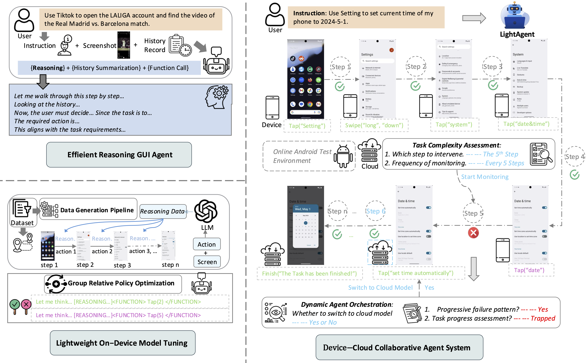

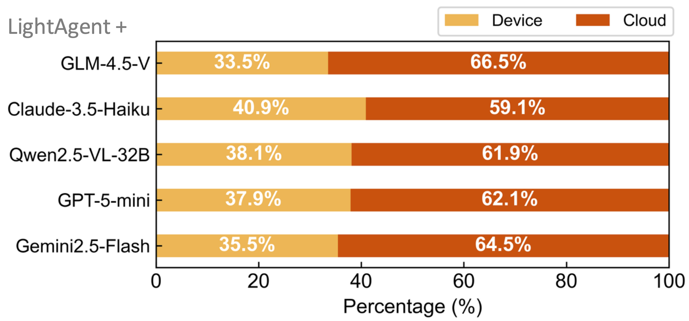
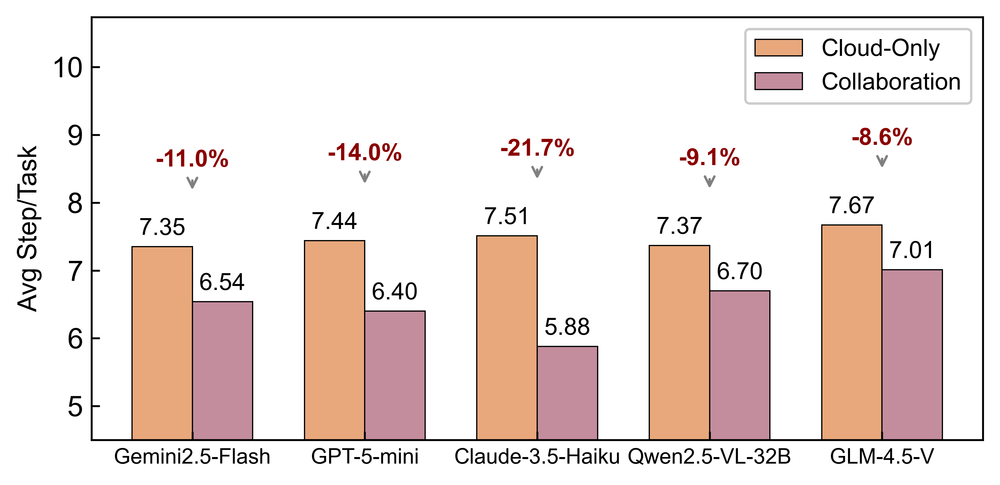

<div align="center">
  <picture>
      
  </picture>
</div >

<div align="center">

# ✨OpenPhone✨: 面向 AI 手机的智能体基础模型

</div>

<div align="center">
  
</div>

<div align="center">
  
</div>

<div align="center">
  <div style="background: linear-gradient(135deg, #667eea 0%, #764ba2 100%); border-radius: 15px; padding: 25px; text-align: center;">
    <p>
      <a href='https://github.com/HKUDS/OpenPhone'></a>
      <a href="https://huggingface.co/datasets/hkuds/OpenPhone_dataset"></a>
      <a href="https://huggingface.co/hkuds/OpenPhone_model"></a>
      <a href='https://github.com/THUDM/Android-Lab'></a>
    </p>
    <p>
      <a href="https://github.com/HKUDS/OpenPhone/stargazers"></a>
      <a href="./Communication.md"></a>
      <a href="./Communication.md"></a>
      <a href=""></a>
      <a href='https://arxiv.org/abs/2510.22009'></a>
    </p>
  </div>
</div>

</div>

<div align="center">
  <div style="width: 100%; height: 2px; margin: 20px 0; background: linear-gradient(90deg, transparent, #00d9ff, transparent);"></div>
</div>

<div>
  <div style="background: linear-gradient(135deg, #f093fb 0%, #f5576c 100%); border-radius: 16px; padding: 28px; margin: 24px 0; box-shadow: 0 8px 32px rgba(245,87,108,0.2);">
    <h2 style="color: white; margin: 0 0 8px 0; font-size: 24px; font-weight: bold;">
      <span style="background: white; color: #f5576c; padding: 3px 14px; border-radius: 20px; font-size: 24px; font-weight: bold;">🔥 重大更新：</span>
      &nbsp;PhoneCLI — 从 App 界面到移动智能体的可调用命令
    </h2>
    <p style="color: rgba(255,255,255,0.7); margin: 0 0 6px 0; font-size: 14px;">🆕 2026 年 9 月</p>
    <div align="center">
      
    </div>
    <div align="center">
      
    </div>
    <p style="color: rgba(255,255,255,0.95); margin: 0 0 16px 0; font-size: 15px; line-height: 1.7;">
      移动端 GUI 智能体依赖「感知–行动」循环运行：每一步都要截图、调用视觉语言模型（VLM）、再发出一个动作。它慢、贵、脆弱——而其中绝大部分工作其实是导航，且日常导航是静态的、有序的、被反复执行的。<strong style="color: white;">PhoneCLI 把 app 的 GUI 导航编译成可调用命令</strong>，既不需要 app 内部 API，也不需要运行时插桩，更不需要训练模型。离线阶段，PhoneCLI 从外部探索目标 app，把它的屏幕、可交互元素与跳转关系提炼成一张<strong style="color: white;">带语义标注的导航图（app map）</strong>；每个屏幕都对应一条确定性命令——抵达它的回放序列。在线阶段，智能体先选择一条命令、执行前先做校验，然后<strong style="color: white;">以亚秒级速度确定性执行，VLM 开销为零</strong>；开放式交互、以及编译路径的任何一次失败，都会回退到内置的 VLM 解释器——也就是纯 VLM 智能体本身，因此<strong style="color: white;">编译只会有帮助</strong>。
    </p>
    <ul style="color: rgba(255,255,255,0.95); margin: 0 0 20px 0; font-size: 14px; line-height: 1.8; padding-left: 20px;">
      <li>🗺️ <strong>App Map</strong> — BFS 爬取每个 app 的每个屏幕、元素和导航路径，生成为结构化 YAML 图</li>
      <li>⚡ <strong>宏回放</strong> — 高频操作以亚秒级速度确定性执行，零 VLM 开销</li>
      <li>🧠 <strong>智能降级</strong> — 当任务无法匹配任何宏时，自动降级为 VLM 推理模式</li>
      <li>📦 <strong>8 个预构建 Map</strong> — 微博、foodpanda、Calendar、京东、大众点评、小红书、Music、系统设置，开箱即用</li>
      <li>🔗 <strong>跨 App 调度器</strong> — 跨 app 任务自动分解为单 app 子任务</li>
      <li>🧪 <strong>AndroidLab 评估</strong> — 同一套思路在官方 AndroidLab 基准（9 个 app / 138 个任务）上完成评测：每个 app 都编译了 app map，并配有纯 VLM 基线做同条件对比</li>
    </ul>
    <p style="margin: 0;">
      <a href="./phonecli/README_CN.md" style="background: white; color: #f5576c; padding: 10px 24px; border-radius: 8px; text-decoration: none; font-weight: bold; font-size: 14px;">📖 完整 iOS 真机文档 →</a>
      &nbsp;&nbsp;
      <a href="./phonecli_android/README_CN.md" style="background: white; color: #f5576c; padding: 10px 24px; border-radius: 8px; text-decoration: none; font-weight: bold; font-size: 14px;">🧪 AndroidLab 评估文档 →</a>
      &nbsp;&nbsp;
      <a href="#-phonecli-从-app-界面到移动智能体的可调用命令" style="background: rgba(255,255,255,0.15); color: white; padding: 10px 24px; border-radius: 8px; text-decoration: none; font-weight: bold; font-size: 14px; border: 1px solid rgba(255,255,255,0.35);">详细阅读 ↓</a>
    </p>
    <p style="margin: 16px 0 0 0; color: rgba(255,255,255,0.95); font-size: 14px;">
      📄 <strong style="color: white;">PhoneCLI 论文</strong> —— 在 arXiv 上阅读全文：
      <a href="https://arxiv.org/abs/2609.35671"></a>
    </p>
  </div>
</div>

## 📖 目录

- [🎯 什么是 OpenPhone？](#-什么是-openphone)
  - [🤔 为什么是 3B 参数？](#-为什么是-3b-参数)
  - [💡 研究亮点](#-研究亮点)
    - [🔍 OpenPhone‑3B：轻量级智能体模型](#-openphone3b轻量级智能体模型)
    - [为什么 3B 是手机智能体的最佳平衡点](#为什么-3b-是手机智能体的最佳平衡点)
  - [🚀 模型发布与资源](#-模型发布与资源)
    - [📦 即刻部署的模型](#-即刻部署的模型)
    - [🛠️ 完整训练流水线](#️-完整训练流水线)
  - [🚀 快速开始](#-快速开始)
    - [📱 AndroidLab 基准测试环境配置](#-androidlab-基准测试环境配置)
    - [🚀 模型部署与推理](#-模型部署与推理)
    - [⚙️ 测试前配置](#️-测试前配置)
  - [🖥️ PhoneCLI：从 App 界面到移动智能体的可调用命令](#-phonecli-从-app-界面到移动智能体的可调用命令)
    - [核心理念](#核心理念)
    - [工作原理](#工作原理)
    - [为什么重要](#为什么重要)
    - [快速开始](#快速开始)
  - [🌟 OpenPhone 核心特性](#-openphone-核心特性)
    - [🤖 轻量级智能体基础模型](#-轻量级智能体基础模型)
    - [☁️ 端云协同框架](#️-端云协同框架)
    - [🎯 全面的手机智能体评估平台](#-全面的手机智能体评估平台)
  - [🌟 技术创新与实现](#-技术创新与实现)
    - [🧠 模型训练：SFT+RL](#-模型训练sftrl)
    - [☁️ 端云协同框架](#️-端云协同框架-1)
    - [💾 面向手机智能体的高效记忆机制](#-面向手机智能体的高效记忆机制)
  - [🧪 测试与评估](#-测试与评估)
    - [单任务测试](#单任务测试)
    - [批量评估脚本](#批量评估脚本)
    - [更多 App 文档](#更多-app-文档)
  - [📊 结果生成](#-结果生成)
    - [LLM 评估器配置](#llm-评估器配置)
    - [生成评估结果](#生成评估结果)
    - [批量测试文件管理](#批量测试文件管理)
  - [🎯 📊 OpenPhone 主要评估发现](#-openphone-主要评估发现)
    - [🏆 小模型，大性能](#-小模型大性能)
    - [🥊 竞争力表现](#-竞争力表现)
    - [🔄 端云框架有效](#-端云框架有效)
    - [🧠 更长的 Prompt 并非总是更好](#-更长的-prompt-并非总是更好)
  - [📈 手机智能体端云分布分析](#-手机智能体端云分布分析)
    - [📊 负载分布](#-负载分布)
    - [💰 效率收益](#-效率收益)
    - [🎯 模型能力影响](#-模型能力影响)
  - [⚡ 推理速度对比](#-推理速度对比)
    - [🎯 速度优势](#-速度优势)
    - [📊 量化对比](#-量化对比)
    - [💡 实际意义](#-实际意义)
  - [🌟 引用](#-引用)
  - [🔗 相关项目](#-相关项目)
  - [📜 许可证](#-许可证)

## 🎯 什么是 OpenPhone？

**问题**：大多数 AI 智能体依赖昂贵的云端 API 和大模型，这在真实世界的端侧部署中并不现实。当手机每次交互都需要调用外部服务时，用户面临**隐私风险**、**延迟问题**和**高额成本**。

**我们的方案**：OpenPhone 推出了首个**面向手机端侧交互的开源 3B 参数智能体基础模型**。这个紧凑的视觉-语言模型完全本地运行——意味着**无隐私顾虑**、**无云端依赖**和**零 API 费用**。

## 🤔 为什么是 3B 参数？

我们相信，移动 AI 的未来不仅在于让模型越来越大，更在于让它们在实际约束条件下更智能、更高效。我们的 3B 模型具备：

- ⚡ **边缘优化**：足够高效，可在消费级 GPU 和下一代移动 NPU 上运行。
- 🔒 **隐私优先**：所有计算留在你的设备上。
- 💰 **零成本**：无需云端推理，无持续性 API 费用。
- 🎯 **高性能**：通过先进的训练方法，达到媲美 7B–9B 模型的性能。

---

## 💡 研究亮点

### 🔍 OpenPhone‑3B：轻量级智能体模型

考虑到当前边缘设备的计算限制，**≤3B 参数**的模型在能力与可部署性之间取得了实际平衡。基于这一洞察，我们推出 **OpenPhone‑3B**，一个轻量但强大的端侧智能体模型。

- **模型规模与架构**：专为在移动端紧张的计算约束下进行高效端侧推理而设计的视觉-语言模型。
- **原生边缘设计**：主要本地智能体，兼容消费级 GPU 和移动 NPU，完全消除持续的云端依赖。
- **GUI 感知操作能力**：经过视觉理解、指令遵循和跨真实移动任务的结构化操作生成训练。
- **开源发布**：完整的模型权重、配置和推理栈，赋能社区部署和开发。
- **最佳平衡点**：3B 规模提供最佳平衡——显著强于微型模型，同时可在更大模型无法部署的地方运行。

### 为什么 3B 是手机智能体的最佳平衡点

- **硬件匹配**：3B 参数量与消费级 GPU 内存（8-12GB）以及新兴的移动 NPU 计算预算完美契合。
- **速度优势**：3B 模型推理速度比 7B 方案快 3-5 倍，同时在亚秒级 GUI 响应中保持有竞争力的精度。
- **能效优势**：更小的模型占用延长电池续航——这对移动端部署至关重要，因为功耗直接影响用户体验。
- **隐私优先**：让手机任务完全在端侧运行，保护用户隐私的同时消除网络依赖。
- **成本节约**：本地处理消除了昂贵的云端 API 和每次请求的计费，实现可持续运行。

---

## 🚀 模型发布与资源

### 📦 即刻部署的模型

- **模型权重**：OpenPhone-3B 已发布于 [Hugging Face](https://huggingface.co/hkuds/OpenPhone_model)，提供研究和商业用途的完整授权。
- **生产级部署**：预配置的 vLLM 推理脚本，可实现优化吞吐量和内存使用的快速部署。

### 🛠️ 完整训练流水线

- **可复现方案**：完整的训练实现，包括我们创新的两阶段方法（SFT + 基于合成 GUI 数据的 GRPO 风格强化学习）。
- **定制化支持**：model_training/ 中的详细文档，使研究人员能够为特定领域的手机任务调整模型，或扩展到新的移动平台。
- **数据生成范式**：大规模创建高质量训练数据的脚本和方法论。

## 🚀 快速开始

本项目包含为全面移动智能体开发和评估设计的核心组件：

- 🖥️ 对于 **手机智能体 CLI**，请参考 [phonecli](./phonecli/README_CN.md) — 构建 app map 并在 iOS 设备上运行自动化任务。
- ⚡ 对于**模型训练**，请参阅训练指南 [README](./model_training/README.md) 获取完整的配置和执行说明。
- 🔧 对于**数据生成流水线**，请参阅数据准备指南 [README](./prepare_data/README.md) 获取详细的实现步骤。

以下我们着重介绍基于 AndroidLab 基准框架的评估。

### 📱 AndroidLab 基准测试环境配置

安装：请遵循 [AndroidLab](https://github.com/THUDM/Android-Lab) 官方文档完成安装配置。<br>

**环境配置**：
- 推荐模式：AVD on Mac (arm64) — 已在我们的实验中验证。<br>
- App 安装：需要手动安装并进行任务相关的特定配置。<br>
- 兼容性说明：原始 Docker 镜像与 AVD 环境不兼容。<br>

### 🚀 模型部署与推理

**vLLM 集成**：
- 推理脚本位于 ./vllm_script/ 目录<br>
- 针对高效小模型部署进行了优化<br>

**模型获取**：
- OpenPhone 权重：3B 参数模型托管于 [HuggingFace](https://huggingface.co/hkuds/OpenPhone_model)<br>
- 部署流程：下载权重 → 通过 vLLM 部署 → 配置推理服务<br>
- 即开即用：与评估流水线无缝集成<br>

### ⚙️ 测试前配置

- 需要配置 API：在 ./evaluation/evaluation.py 中配置云端模型凭证：第 63 行、第 75 行、第 81 行<br>
- 即将上线：更便捷的配置界面正在开发中<br>

---

## 🖥 PhoneCLI: 从 App 界面到移动智能体的可调用命令

### 核心理念

想想你是如何使用手机的。打开 Wi-Fi、查看今天的日历、搜索联系人——这些都是你每天执行几十次的**重复固定操作序列**。通过 VLM 驱动的 GUI 交互来完成这些操作，不仅慢（每步 2–5 秒）、贵（每次截图都要调用 API），而且不可靠（VLM 经常产生坐标幻觉）。

**PhoneCLI** 采用了不同的思路。它不把每个任务都当作全新的 GUI 探索，而是**为每个 app 预构建导航图（app map）**，然后将常规操作作为确定性宏回放执行。VLM 只在真正需要时才被调用——处理新任务、验证结果或跨 app 推理。

### 工作原理

**第一步：构建 app map** — BFS 爬虫通过 WebDriverAgent 系统地探索 app 的每个屏幕，记录所有可点击元素、它们的坐标以及屏幕之间的导航路径。每个元素都会被分类（固定 vs. 动态），并由 LLM 进行语义元数据标注。

```yaml
# App map 将每个屏幕编码为节点，每个元素编码为边
screens:
  - id: screen_0
    description: "系统设置主页"
    elements:
      - text: Wi-Fi
        center: [0.50, 0.15]      # 归一化坐标
        fixed: true                 # 跨版本稳定不变
        leads_to: screen_1          # 点击后导航到哪个屏幕

screen_macros:
  screen_1: [force_stop, launch, tap(195, 126)]  # 精准回放序列
```

**第二步：运行任务** — Agent 将自然语言任务映射到具体的宏操作，确定性回放，然后可选地通过单次 VLM 截图验证。大多数常规任务仅需 **0–1 次 VLM 调用**即可完成。

**第三步：处理意外** — 当任务无法匹配任何宏时（例如"在附近找一家营业到很晚的餐厅"），Agent 退化为纯 VLM 推理模式。系统仅在需要时才优雅降级为 GUI 模式。

### 为什么重要

直觉很简单：**不要每次都让 VLM 去重新发现你已经知道的东西**。一次预计算导航图，然后永远可靠地回放。这与 CLI 工具比 GUI 更快的原理相同——现在应用到了手机自动化上。

### 快速开始

```bash
# 1. 为任意 iOS app 构建 map（一次性，约 10 分钟）
python phonecli/cli.py macro auto-build -b com.apple.Preferences -a Settings

# 2. 运行任务
python phonecli/run.py --task "打开飞行模式"

# 3. 交互式 daemon（持续多任务会话）
python phonecli/run.py --interactive
```

工具包自带了 **8 个 app 的预构建 map**（微博、foodpanda、Calendar、京东、大众点评、
小红书、Music、系统设置），每个覆盖 20–50 个屏幕和数百个元素。

➜ **[完整 iOS 真机文档](./phonecli/README_CN.md)** — 环境配置、WebDriverAgent、
app map 构建、CLI 参考、常见问题排查。

➜ **[AndroidLab 评估文档](./phonecli_android/README_CN.md)** — 官方 AndroidLab 基准
（9 个 app / 138 个任务）、编译好的 app map、宏智能体与纯 VLM 基线、判分流程。

---

## 🌟 OpenPhone 核心特性

### 🤖 轻量级智能体基础模型

• **紧凑架构**：专为移动 GUI 任务优化的**3B 规模**视觉-语言模型，计算开销极小。<br>
• **端侧部署**：真正兼容智能手机的模型，在本地运行的同时保持有竞争力的性能。

### ☁️ 端云协同框架

• **动态编排**：实时评估任务复杂度，根据执行需求在端侧和云端模型之间智能切换。<br>
• **成本-性能优化**：战略性资源分配，利用高性价比的端侧模型，同时通过选择性调用云端模型弥补能力不足。

### 🎯 全面的手机智能体评估平台

• **扩展的基准测试集**：在 AndroidLab 之外，纳入 25+ 个跨主流移动应用的真实世界验证任务。<br>
• **多维度评估**：覆盖性能指标、计算效率和实际部署场景的全面评估。

---

## 🌟 技术创新与实现

### 🧠 模型训练：SFT+RL

• **合成数据生成**：利用先进的 MLLM 创建高质量的推理链训练数据，解决人工标注稀缺的难题。<br>
• **两阶段训练**：SFT 注入 GUI 基础知识，GRPO 强化学习优化任务完成准确率。<br>
• **小模型增强**：通过结构化训练，使 3B 模型在 GUI 任务上达到媲美 7B-9B 模型的性能。

### ☁️ 端云协同框架

• **动态任务评估**：实时评估复杂度，决定监控端侧模型性能的时机和频率。<br>
• **智能编排**：根据执行进度和失败模式，在端侧和云端模型之间无缝切换。<br>
• **成本-性能优化**：在保持高任务成功率的同时，减少约 10% 的云端调用。

### 💾 面向手机智能体的高效记忆机制

• **长程推理**：多步思维链推理与反思纠错相结合，增强决策能力。<br>
• **文本摘要**：将高分辨率截图压缩为紧凑的文本表示，实现高效记忆管理。<br>
• **结构化上下文保持**：通过优化的 token 使用，在资源受限环境中保持 10-20 步的历史上下文。

---



---

## 🧪 测试与评估

### 单任务测试

使用以下命令结构测试单个任务：

```bash
python eval.py -n test_name -c 你的 config.yaml 路径 --task_id task_id
```

使用示例：

```bash
python eval.py -n all_cloud_v1_hyper -c ./configs/example_xml_cloud_hyper.yaml --task_id zoom_1
```

### 批量评估脚本

`./test_script` 中提供了便捷的批量测试脚本：

• `all_test_cloud_v1_hyper.sh`：评估所有 138 个 AndroidLab 基准任务<br>
• `all_test_cloud_v1_hyper_add.sh`：评估四个额外移动应用的任务<br>

### 更多 App 文档

有关四个额外 app 任务的详细信息，请参阅文档：[Additional Apps Documentation](./docs/new_apps.md)

---

## 📊 结果生成

### LLM 评估器配置

必要配置：在 ./evaluation/tasks/llm_evaluator.py 中配置 LLM 服务凭证：

• 第 10 行：API 配置<br>
• 第 12 行：服务地址<br>

💡 改进：我们的实现以 LLM 驱动的评估替代 AndroidLab 的基于规则的评估，提供更细致和准确的任务完成判断。

### 生成评估结果

使用以下命令生成评估结果：

```bash
python generate_result.py --input_folder ./logs/evaluation/ --output_folder ./logs/evaluation/ --output_excel ./logs/evaluation/test_name.xlsx
```

### 批量测试文件管理

⚠️ 注意：使用 ./test_script/ 中的批量脚本时：<br>
• 需要手动迁移：将生成的评估文件从脚本目录移动到 ./logs/<br>
• 然后执行：运行上述结果生成命令<br>
• 防止错误：此步骤确保文件路径正确和结果正确编译<br>

---

## 🎯 📊 OpenPhone 主要评估发现

### 🏆 小模型，大性能

- **规模 vs 性能**：OpenPhone-3B 在保持紧凑架构部署优势的同时，达到与 9B 模型可比的性能。
- **效率冠军**：确立了真正的"小型强大"地位，挑战了移动 AI 领域"更大即更好"的假设。

### 🥊 竞争力表现

- **对比商业模型**：在标准基准测试中，OpenPhone-3B 相比轻量级商业模型展现出可观的表现。
- **小模型的潜力**：令人鼓舞的结果验证了紧凑型开源方案在移动智能体开发中的可行性。

### 🔄 端云框架有效

- **高效与性能兼得**：OpenPhone 的混合架构在显著降低云端模型使用的同时，提供接近最优的性能。
- **智能路由**：证明了智能的任务路由在实际应用中创造了切实的效率提升。

### 🧠 更长的 Prompt 并非总是更好

- **上下文的重要性**：扩展的提示策略只有在与足够强大的云端模型配对时才能提升性能。
- **智能匹配**：强调了将推理复杂度与模型能力匹配的重要性，而非简单地假设更长的 Prompt 总是有帮助。

<p align="center">
  
</p>

## 📈 手机智能体端云分布分析

为评估我们混合方案的实际效率，我们测量了不同 MLLM 的关键指标：每个任务的平均总步数、端侧与云端模型处理的步骤比例，以及与纯云端基准相比的云端调用减少量。

### 📊 负载分布

云端模型仍处理约 65% 的执行步骤，反映了较小端侧模型在处理复杂推理任务时的计算局限性。

### 💰 效率收益

引入端侧处理可实现约 10% 的云端 API 调用减少，直接转化为成本节约和延迟降低。

### 🎯 模型能力影响

像 GLM-4.5V 这样的高级云端模型显示出更少的云端依赖减少，因为它们卓越的能力使得无需端侧辅助即可更独立地完成任务。

<p align="center">
  
  
</p>

## ⚡ 推理速度对比

我们使用 vLLM 在不同 GPU 配置下评估了每步平均推理时间，以评估真实世界的部署可行性。注意，GLM-4.1V-9B-Thinking 由于上下文长度限制无法在单张 3090 GPU 上运行。

<div align="center">

| 模型                     | GPU         | 规模 | SR   | 每步耗时       |
| ------------------------ | ----------- | ---- | ---- | -------------- |
| Qwen2.5-VL-7B-Instruct   | 单卡 3090   | 7B   | 10.1 | 6289.15 ms     |
| OpenPhone                | 单卡 3090   | 3B   | 15.2 | 4170.63 ms     |
| GLM-4.1V-9B-Thinking     | 双卡 3090   | 9B   | 24.6 | 14584.89 ms    |
| Qwen2.5-VL-7B-Instruct   | 双卡 3090   | 7B   | 10.1 | 4587.79 ms     |
| OpenPhone                | 双卡 3090   | 3B   | 15.2 | 3524.25 ms     |

</div>

### 🎯 速度优势

- **明确胜出**：得益于其轻量级的 3B 架构，OpenPhone 展示了显著的推理速度优势。
- **真实世界就绪**：在计算资源受限时速度优势更加明显，符合典型的边缘部署场景。

### 📊 量化对比

- **3.5 倍更快**：单卡 3090 上的 OpenPhone vs 双卡 3090 上的 GLM-4.1V-9B-Thinking。
- **4 倍更快**：双卡 3090 上的 OpenPhone vs 双卡 3090 上的 GLM-4.1V-9B-Thinking。
- **OpenPhone 的轻量优势**：GLM-4.1V-9B-Thinking 无法在单卡 3090 上运行，严重限制了边缘部署选项。

### 💡 实际意义

取舍是明确的：虽然像 GLM-4.1V-9B-Thinking 这样的大模型取得了更高的任务性能，但 OpenPhone 的速度优势使其在响应时间和硬件约束至关重要的真实世界端侧场景中更具适用性。

---

## 🌟 引用

如果本工作对你的研究有帮助，请考虑引用我们的论文。

```
@article{jiang2026phonecli,
  title={PhoneCLI: From App Interfaces to Callable Commands for Mobile Agents},
  author={Jiang, Yangqin and Xu, Lingrui and Huang, Chao},
  journal={arXiv preprint arXiv:2609.35671},
  year={2026}
}

@inproceedings{jiang2026openphone,
  title={OpenPhone: Mobile Agentic Foundation Models},
  author={Jiang, Yangqin and Huang, Chao},
  booktitle={Findings of the Association for Computational Linguistics: ACL 2026},
  pages={30362--30380},
  year={2026}
}
```

## 🔗 相关项目

OpenPhone 建立在优秀的开源项目之上。我们衷心感谢它们的作者和贡献者：

- [AndroidLab](https://github.com/THUDM/Android-Lab) — 基准测试框架。
- [R1-V](https://github.com/StarsfieldAI/R1-V) — GRPO 训练方法论的实现。
- [LLaMA Factory](https://github.com/hiyouga/LLaMA-Factory) — 实现高效模型微调的统一训练框架。

## 📜 许可证

本项目基于 [MIT License](./LICENSE) 发布。

<div align="center">

**如果这个项目对你有帮助，请给我们一个 Star🌟**

**🤖 用智能体赋能 AI 手机！**

<br>

<p align="center">
  <em> ❤️ 感谢访问 ✨ OpenPhone！</em><br><br>
  
</p>


</div>
